# xStudio — UI Documentation by Image

> **Design System**: Material Design 3 (M3)  
> **Tech Stack**: Vite + React 19 + MUI v9  
> **Primary Color Seed**: `#6750A4` (M3 Purple)

---

## Table of Contents

1. [Flow 1: Agent Hub Overview](#flow-1-agent-hub-overview)
2. [Flow 2: Create Agent Wizard](#flow-2-create-agent-wizard)
3. [Flow 3: Chat Tab — Conversational Interface](#flow-4-chat-tab--conversational-interface)
4. [Flow 4: Internal Skills Tab — Skill Management](#flow-5-internal-skills-tab--skill-management)
5. [Flow 5: Global MCPs Tab — Integration Configuration](#flow-6-global-mcps-tab--integration-configuration)
6. [Flow 6: Channels Tab](#flow-7-channels-tab)
7. [Flow 7: Active Jobs Tab — Task Monitoring](#flow-8-active-jobs-tab--task-monitoring)
8. [Flow 8: Sidebar Navigation Overview](#flow-9-sidebar-navigation-overview)

---

## Flow 1: Agent Hub Overview

**Purpose**: Centralized dashboard to view, manage, and access all configured autonomous agents.

**Step 1: Landing Page**
The Hub displays a responsive grid of fixed-width Agent cards. Each card shows the agent's name, personality, underlying model, and a count of bound skills.
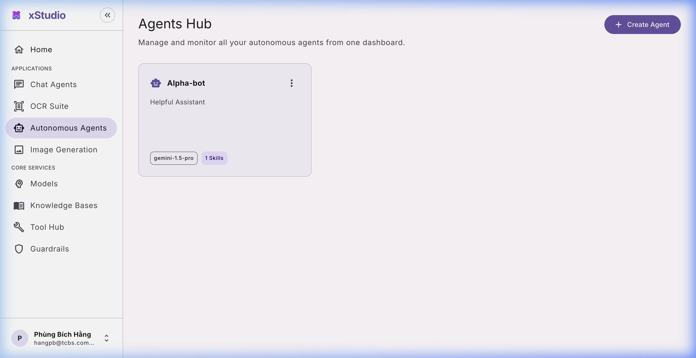

**Step 2: Context Menu (Delete Agent)**
Clicking the three-dot options menu (⋮) on a card opens a small contextual popup. Currently, it supports the destructive "Delete Agent" action rendered in the M3 error color to ensure user awareness.
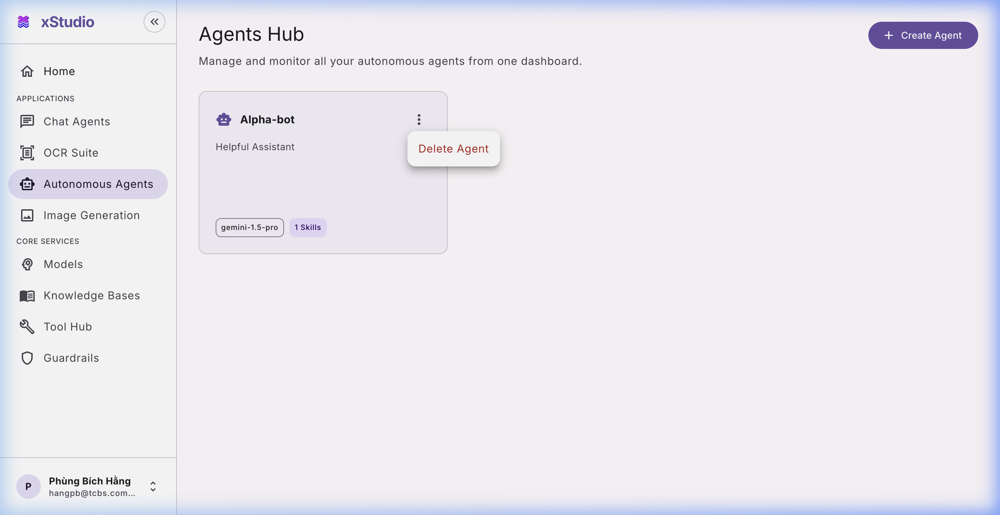

---

## Flow 2: Create Agent Wizard

**Purpose**: Guided setup for provisioning a new autonomous agent across four sequential steps.

**Step 1: Basics**
Users provide the foundational configuration: a unique Agent Name ("Research Assistant"), surface-level description, and selecting the foundational LLM from a dropdown (e.g., `gemini-1.5-flash`).
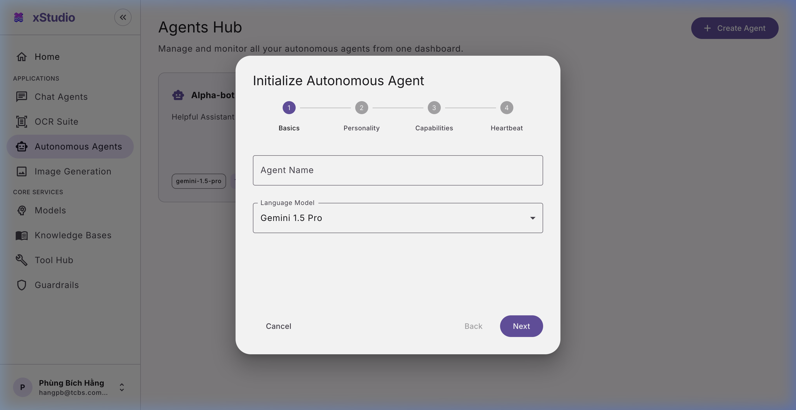
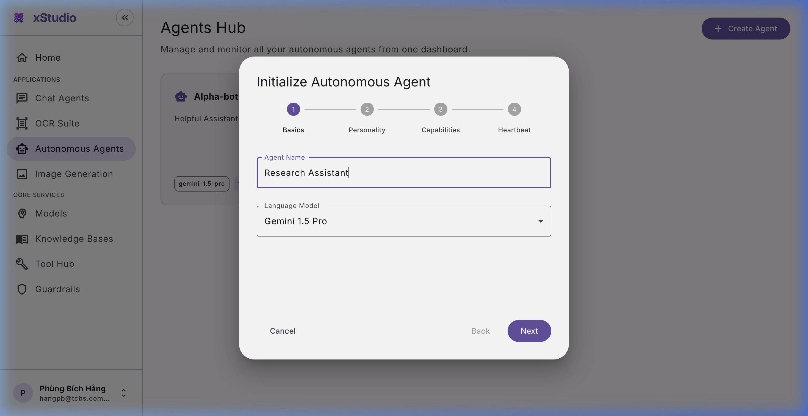
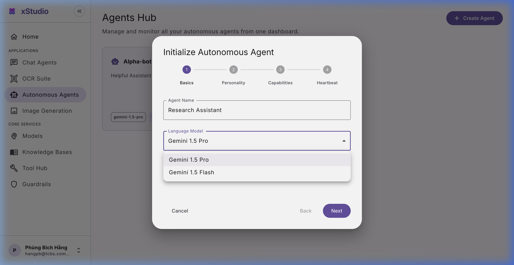

**Step 2: Personality Configuration**
Users inject specialized instructions via a markdown-capable System Prompt layer, dictating how the agent behaves and responds ("You are a helpful research assistant.").
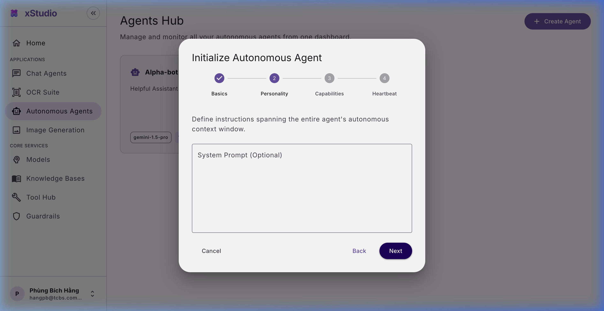

**Step 3: Add Capabilities**
Users can augment the agent natively. Opening the "Search Capabilities..." component reveals an autocomplete dropdown menu. The list is structurally categorized into Native Skills (e.g., Web Serper, Calculator) and MCPs (Model Context Protocols) using clear dividers for scanning visually. Basic built-in capabilities are listed by default beneath in a tonal card.
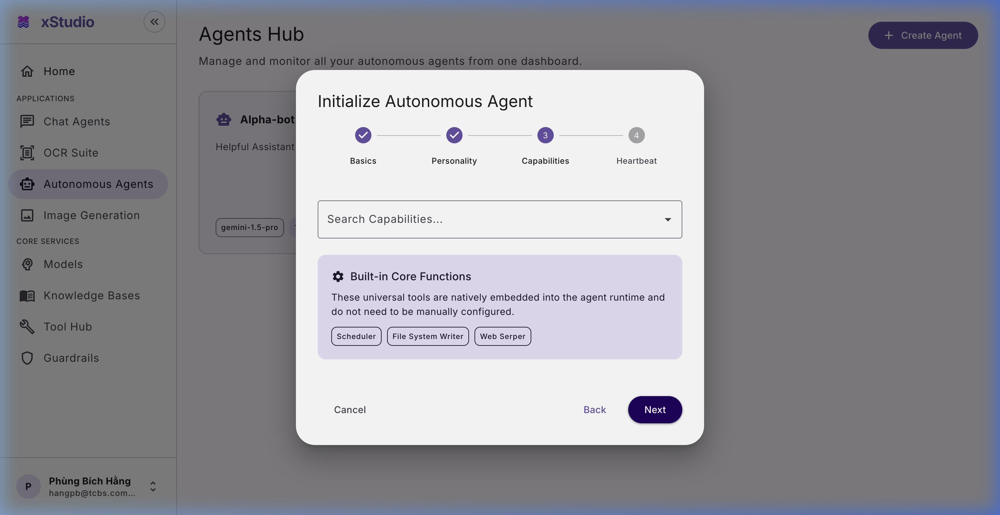
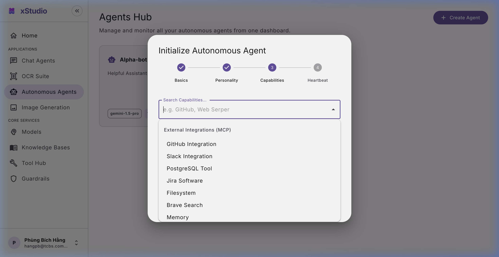

**Step 4: Heartbeat / Wake-up Interval**
Configures autonomous execution schedules. Users set a cron-like interval dictating how frequently the agent wakes up to assess inbound data and perform background jobs. Selecting "Every 1 Hour" ensures cyclic autonomous activity.
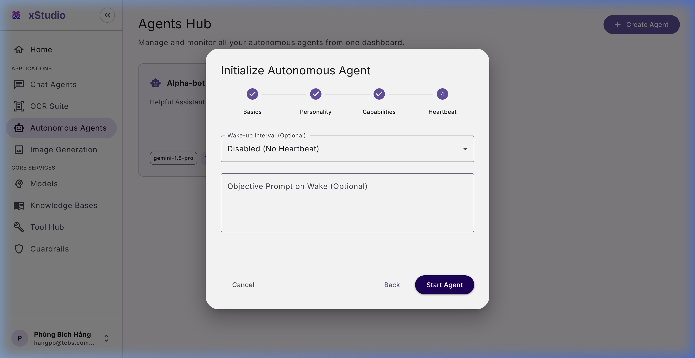
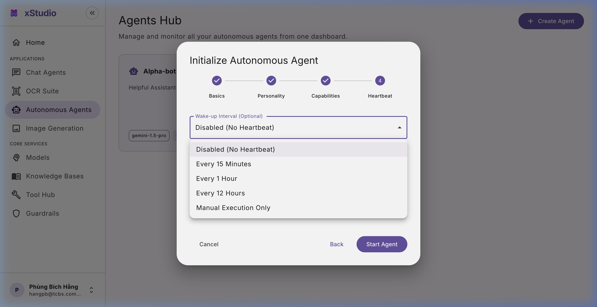

**Step 5: Initialization Complete**
The agent initializes, allocating namespace and routing the user to the inner workspace tab beginning with a generated, structural welcome message from the agent context.
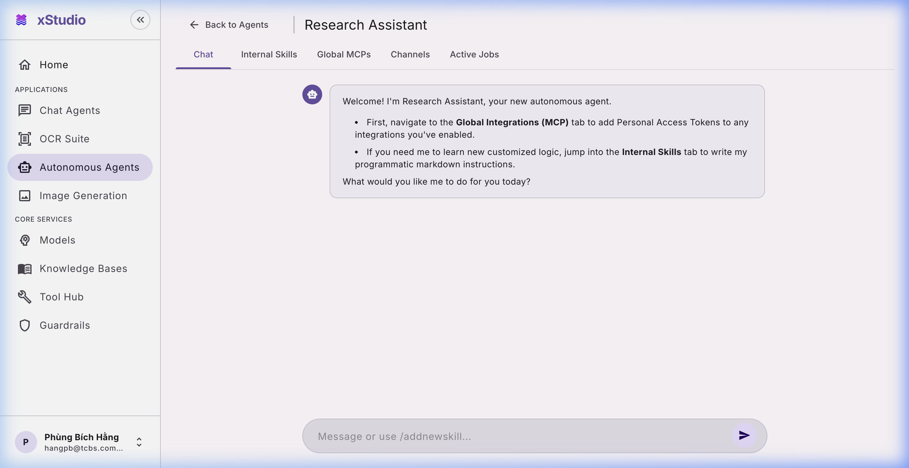

---

## Flow 3: Chat Tab — Conversational Interface

**Purpose**: Direct LLM conversational interaction space providing rich state tracking and markdown parsing.

**Step 1: Welcome & Prompt**
The user is greeted with formatted structural markdown containing instructions and next steps natively parsed by the messaging view component. Text wraps elegantly inside the large radius chat bubble without overflowing boundaries.
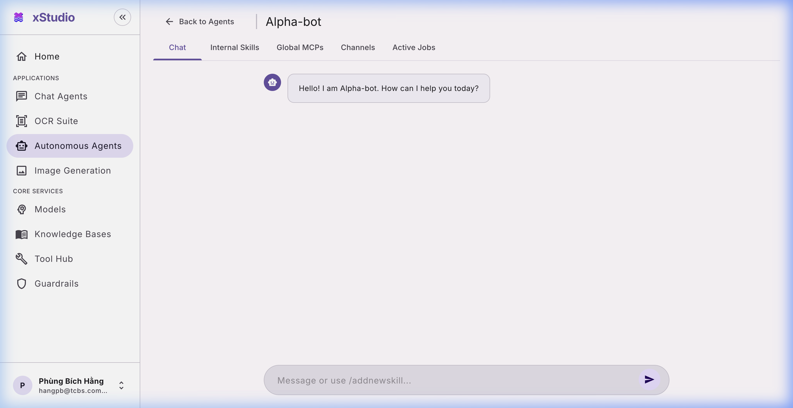

**Step 2: Communication**
Upon typing into the input bar and sending the directive ("Can you scan latest PRs?"), the user message renders on the right (primary container color), while the agent dynamically responds from the left in an off-white surface container.
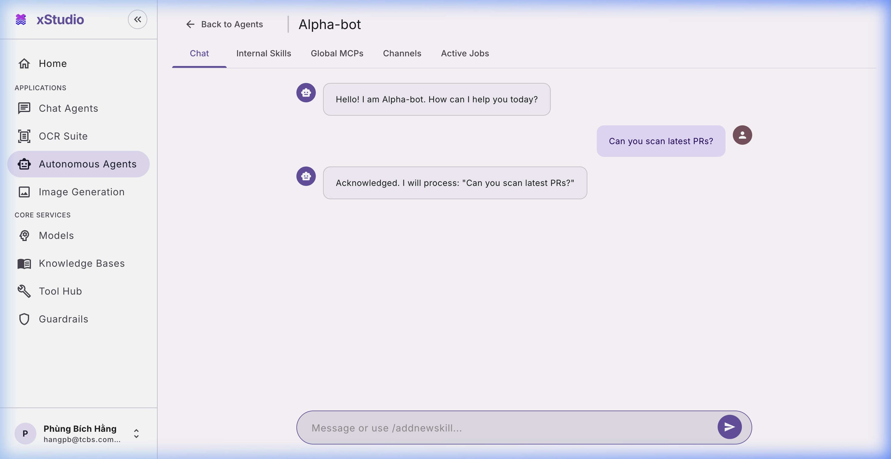

---

## Flow 4: Internal Skills Tab — Skill Management

**Purpose**: Manage local sandboxed logic components built programmatically. 

**Step 1: Skill Library Overview**
Displays customized and core built-in skills stacked vertically with identifying icons and brief descriptions. M3 elevated `Paper` frames keep it organized.
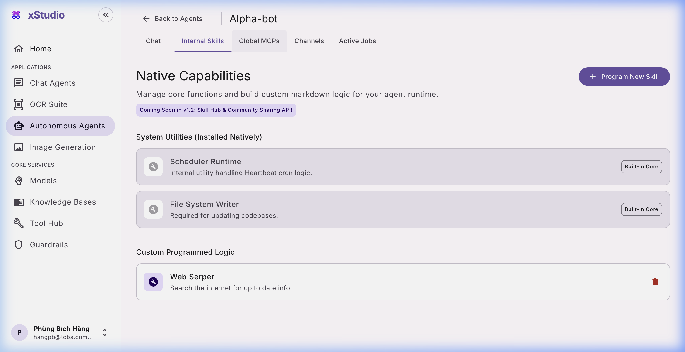

**Step 2: Skill Viewer Drawer**
Selecting any existing skill (e.g., Scheduler Runtime) triggers a right-anchor Drawer overlay. It presents the raw markdown programmatic constraints assigned to that skill visually in read-only form.
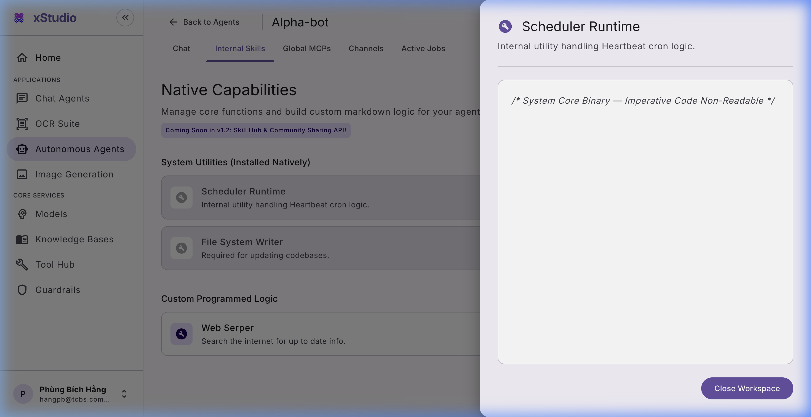

**Step 3: Skill Construction Dialog**
Invoking "Program New Skill" yields a full-screen or large semantic dialog focused solely on coding the agent skill utilizing parameters: Skill Name, Outline, and the core implementation markdown logic block.
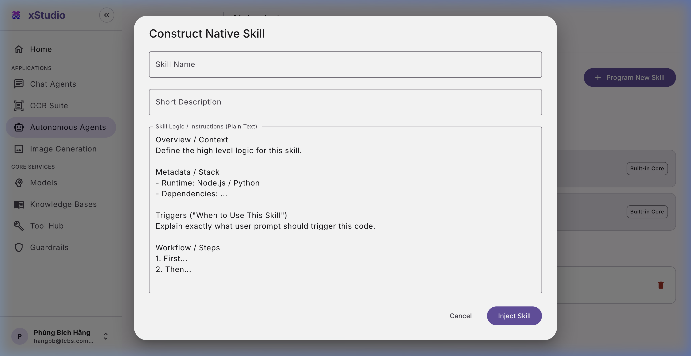

---

## Flow 5: Global MCPs Tab — Integration Configuration

**Purpose**: Securely configure Model Context Protocol bounds. Distinct integrations require tailored credential management based on security policies.

**Detailed Breakdown of 3 MCP Credential Types:**
1. **Require Patterned Auth (Token/PAT)**: Like GitHub or Slack, these mandate passing a bearer token or PAT. Unconfigured integrations alert the user via an orange "Missing" warning badge and an "Add Token" CTA prompt.
2. **Require DB Auth (Database Connection)**: Like PostgreSQL. Instead of a generic token string, they show an "Add DB Credentials" CTA, invoking specialized connection-string inputs.
3. **No Token Required**: Like Filesystem, Fetch, or Memory. Activating these skips the auth sequence immediately assigning a green "Ready to Use" chip with solid active borders indicating they don't necessitate external API handshakes.

**Step 1: Sub-Menu & Library Preview**
The overall interface separating active agent bindings at the top (`Integrations Active`), dragging unbound protocols (`Global Protocol Library`) to the bottom list.
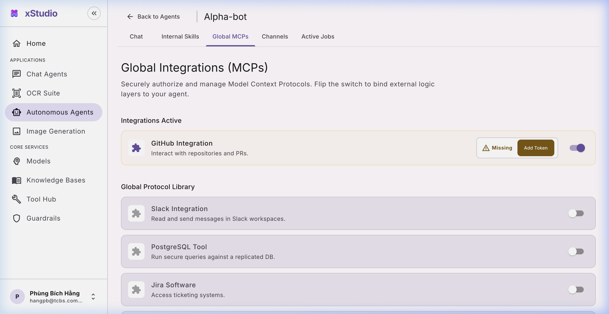

**Step 2: No-Token MCP Activation**
Activating the `Filesystem` MCP securely binds it without user friction — instantly confirming its "Ready to Use" standing.
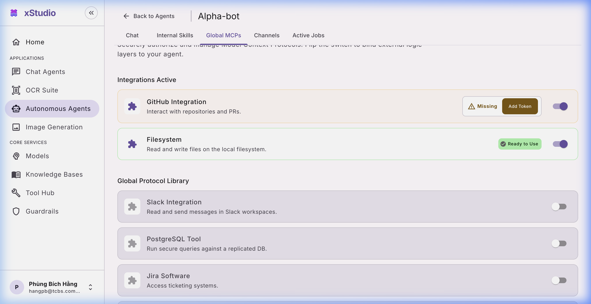

**Step 3: Secure Auth Credential Handshake**
Clicking the explicit "Add Token" element attached to the `GitHub Integration` triggers a secure overlay dialog specifically requesting PAT assignment.
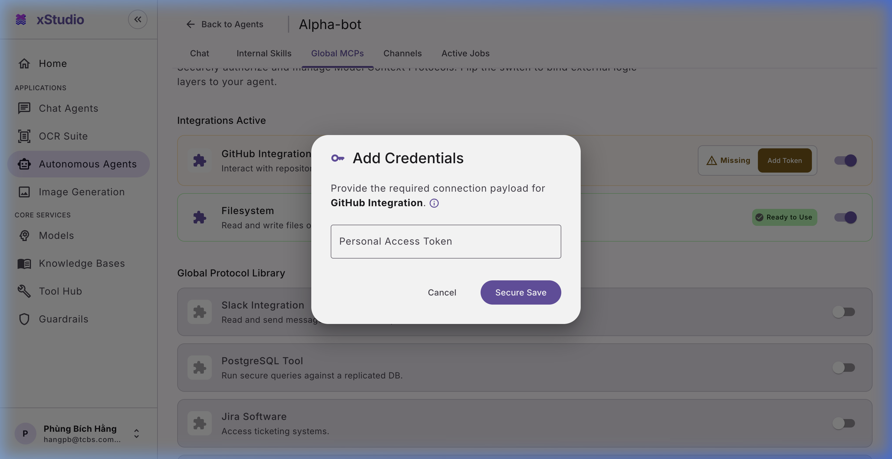

**Step 4: Applied State**
Succeeding injects the key. The UI updates dynamically, rendering the green "Token Applied" status indicator and syncing the surface borders to successful states.
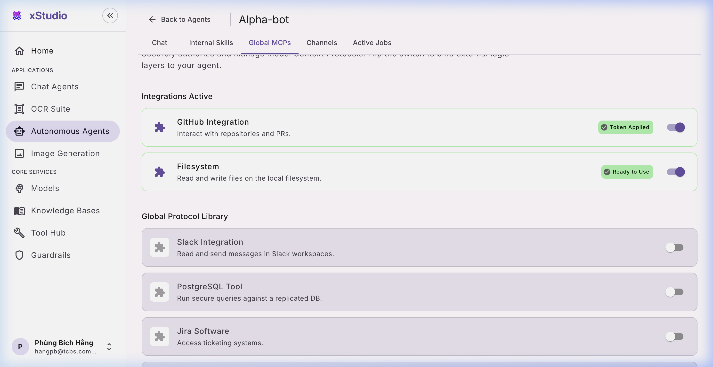

---

## Flow 6: Channels Tab

**Purpose**: Manage communication platform synchronization (where the agent passively listens or responds autonomously outside of xStudio).

**Step 1: Channels Hub**
A master list controlling communication routing modules. 
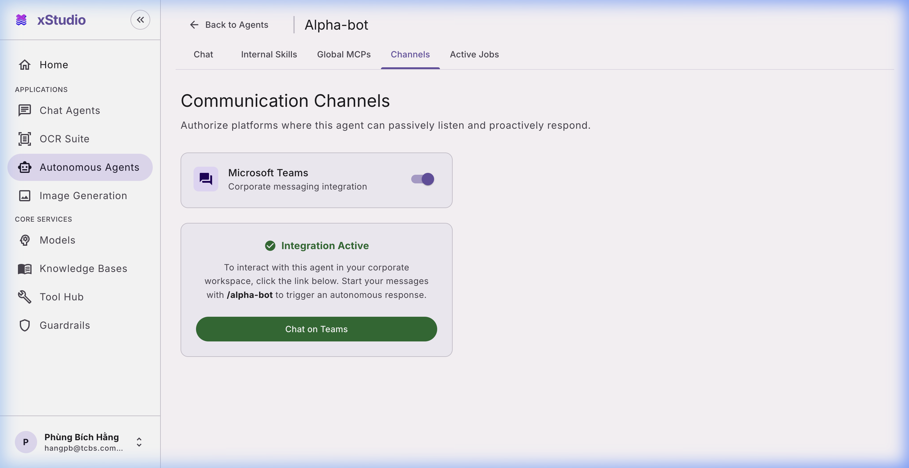

**Step 2: Channel Activation Context**
Engaging the toggle (e.g., Microsoft Teams) triggers a supplementary, highly visible setup & instruction card below standardizing the redirect pathway with an action like "Chat on Teams".

---

## Flow 7: Active Jobs Tab — Task Monitoring

**Purpose**: Live surveillance tracking and historical ledger monitoring for background / cron tasks processed iteratively by the agent's LLM cycle.

**Step 1: Jobs Collapsed Overview**
Displays iterative processes inside isolated M3 accordions encapsulating job titles ("Scan latest unseen PRs") and quick deletion management mechanisms alongside run statuses.
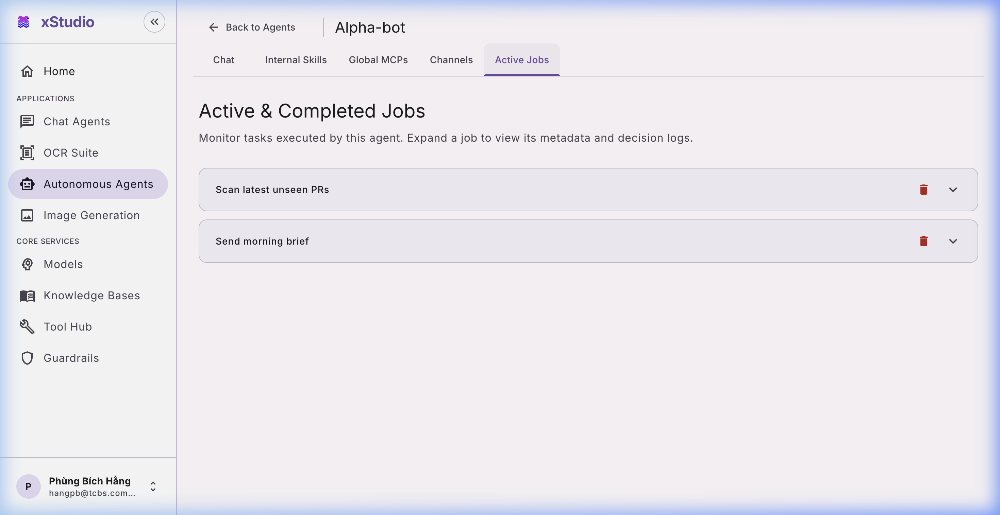

**Step 2: Detailed View — 3 Internal Surveillance Tabs**
Expanding a job panel reveals structured diagnostics segregated into three critical sub-tabs providing deep insight into the execution block.

* **A. Decision Logs View (Default)**: Opens the native pseudo-terminal interface tracing exact logical decision-making steps, network invocations, outputs, API fetches, and system outputs (`[INIT]`, `[NET]`, `[SUCCESS]`).
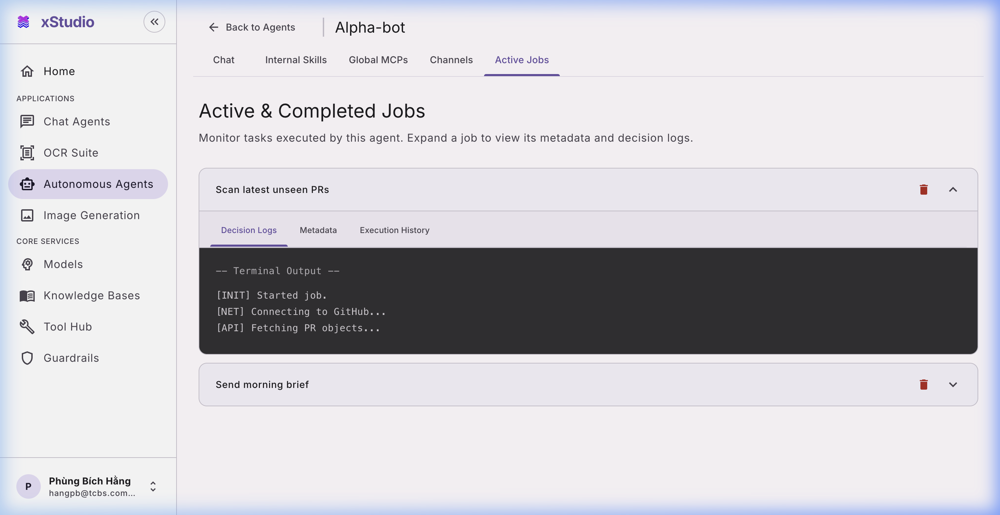

* **B. Metadata View**: Unveils the structural core variables powering the task run. Shows detailed system metrics identifying the host Agent (Alpha-bot), Model (Gemini), Scheduled Time, **Frequency** (the recurrent duration), and Trigger Context origin points.
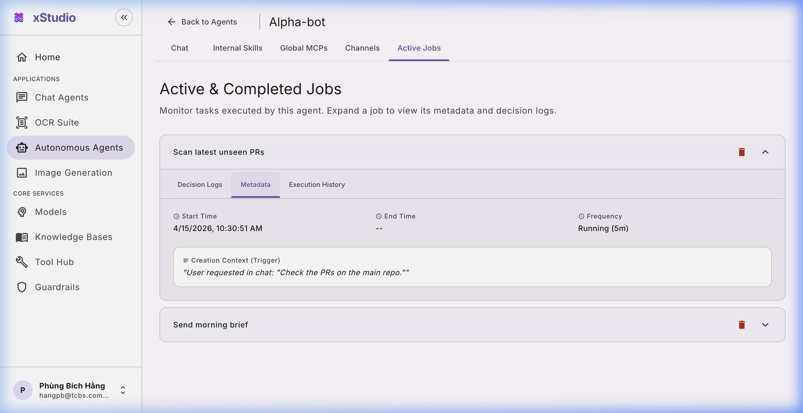

* **C. Execution History View**: Unfurls a historical chronological record tracking individual discrete runtime logs, classifying outcomes conditionally (e.g., successful runs vs runtime anomalies & errors).
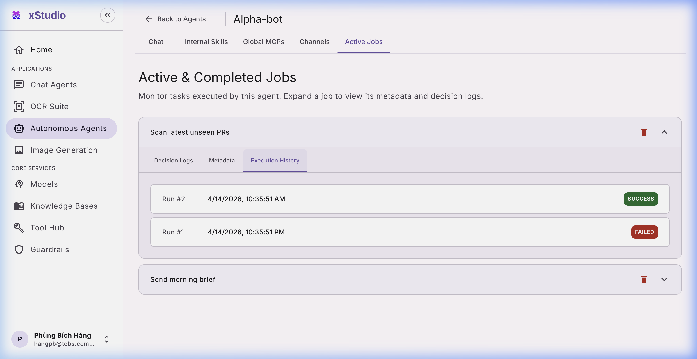

---

## Flow 8: Sidebar Navigation Overview

**Purpose**: Global spatial frame ensuring uniform traversal across modules (Agents, Tools, AI Suites). Features a stateful responsive Drawer structure.

**Step 1: Expanded Root Sidebar**
Contains explicit application titles categorized functionally into subgroups (APPLICATIONS, CORE SERVICES), offering intuitive selection capabilities.
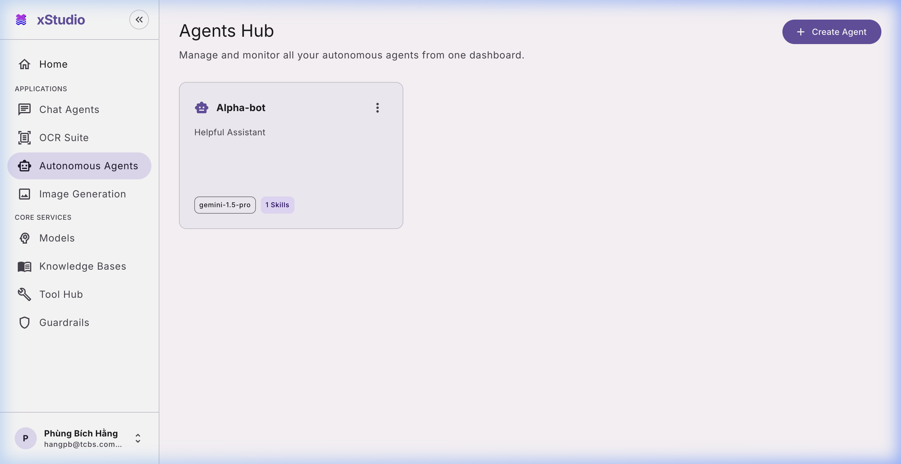

**Step 2: Collapsed Rail Hierarchy**
To allocate maximum canvas real-estate, collapsing the drawer shrinks items to a minimal 80px visual icon-rail while preserving functional navigation.
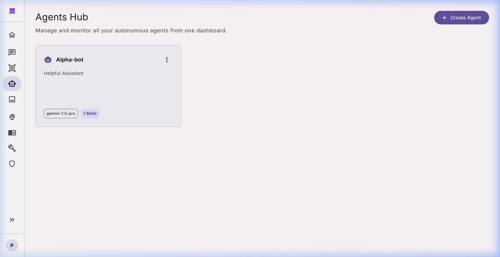
