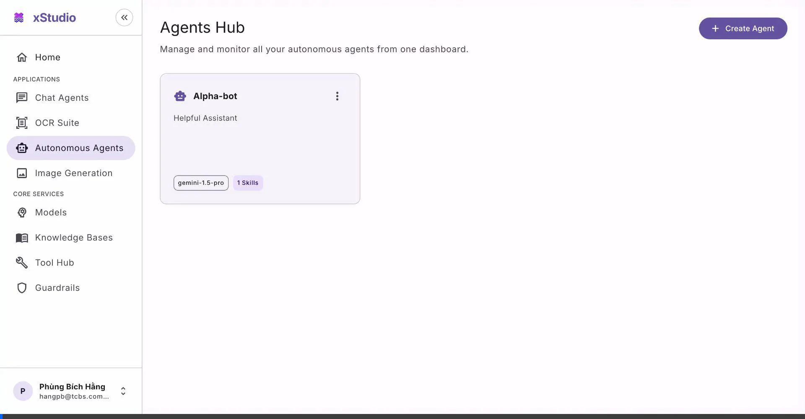
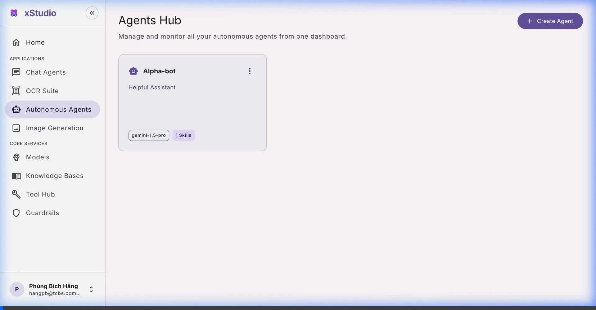
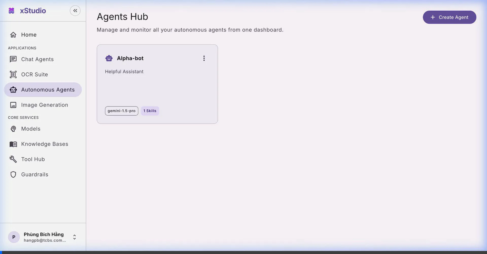
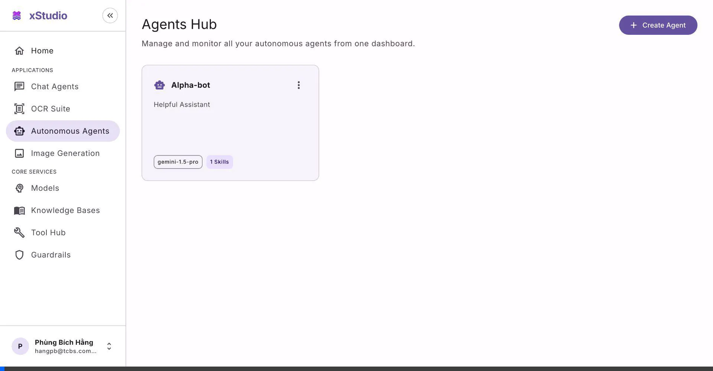

# xStudio — Autonomous Agent UI Flow Documentation

> **Design System**: Material Design 3 (M3)  
> **Tech Stack**: Vite + React 19 + MUI v9  
> **Primary Color Seed**: `#6750A4` (M3 Purple)  
> **Typography**: Inter (Google Fonts)

---

## Table of Contents

1. [Flow 1: Agent Hub Overview](#flow-1-agent-hub-overview)
2. [Flow 2: Create Agent Wizard](#flow-2-create-agent-wizard)
3. [Flow 3: Sidebar Navigation](#flow-3-sidebar-navigation)
4. [Flow 4: Chat Tab — Conversational Interface](#flow-4-chat-tab--conversational-interface)
5. [Flow 5: Internal Skills Tab — Skill Management](#flow-5-internal-skills-tab--skill-management)
6. [Flow 6: Global MCPs Tab — Integration Configuration](#flow-6-global-mcps-tab--integration-configuration)
7. [Flow 7: Channels Tab — Communication Platform Toggles](#flow-7-channels-tab--communication-platform-toggles)
8. [Flow 8: Active Jobs Tab — Task Monitoring](#flow-8-active-jobs-tab--task-monitoring)
9. [Flow 9: Delete Agent](#flow-9-delete-agent)

---

## Flow 1: Agent Hub Overview

**Purpose**: The Agent Hub is the application's landing page. It provides a centralized dashboard to view, manage, and access all configured autonomous agents.

**Key UI Elements**:
- **Page Header**: "Agents Hub" title with descriptive subtitle
- **Create Agent Button**: Pinned top-right, uses M3 filled button with `+` icon
- **Agent Cards**: Responsive CSS Grid layout (`md={4}`) with **fixed 240px height** — card sizes remain uniform regardless of agent name length
- **Card Content**: Agent icon, name (truncated with ellipsis for long names), personality description (3-line clamp), model chip, skill count chip
- **Three-dot Menu**: Overflow menu on each card for contextual actions (e.g., Delete)
- **Hover State**: Elevated shadow on hover (M3 Level 2 elevation)

**User Flow**:
1. User lands on the Agent Hub
2. Scans available agents displayed as a card grid
3. Hovers over cards to see elevation interaction feedback
4. Clicks a card to navigate into that agent's workspace

### Recording

---

## Flow 2: Create Agent Wizard

**Purpose**: A 4-step dialog wizard guides users through provisioning a new autonomous agent with configuration for identity, personality, capabilities, and scheduling.

**Key UI Elements**:
- **Dialog**: Full-width modal with 28px border-radius (M3 extra-large shape), headline-small title "Initialize Autonomous Agent"
- **Stepper**: Horizontal 4-step indicator (Basics → Personality → Capabilities → Heartbeat) with checkmark icons on completed steps
- **Step 1 — Basics**: Agent Name text field, Language Model dropdown (Gemini 1.5 Pro / Flash / Ultra), Short Description field
- **Step 2 — Personality**: System Prompt multiline textarea
- **Step 3 — Capabilities**: Search Capabilities autocomplete field, "Built-in Core Functions" tonal card (M3 secondary-container purple) listing native tools (Scheduler, File System Writer, Web Serper)
- **Step 4 — Heartbeat**: Wake-up Interval dropdown (Every 30 min → Every 6 Hours), MCP notice card
- **Navigation**: Cancel / Back / Next / Start Agent buttons with M3 styling

**User Flow**:
1. User clicks "+ Create Agent" on the Hub
2. Fills in Agent Name and selects a Language Model → clicks **Next**
3. Writes a System Prompt for the agent's personality → clicks **Next**
4. Reviews built-in capabilities and optionally adds more → clicks **Next**
5. Configures the heartbeat interval → clicks **Start Agent**
6. The dialog closes and the user is navigated to the new agent's workspace with the welcome message displayed in the Chat tab

### Recording

---

## Flow 3: Sidebar Navigation

**Purpose**: The persistent sidebar provides global navigation across all xStudio applications and core services. It supports collapse/expand for maximizing workspace area.

**Key UI Elements**:
- **Expanded State**: Full-width drawer with xStudio logo, application list (Chat Agents, OCR Suite, Autonomous Agents, Image Generation), and core services (Models, Knowledge Bases, Tool Hub, Guardrails)
- **Collapsed State**: Icon-only rail showing just the navigation icons
- **Toggle Button**: Double-arrow icon to collapse (top) and expand (bottom)
- **Active Indicator**: M3 secondary-container background on the active item
- **Section Labels**: "APPLICATIONS" and "CORE SERVICES" group headers in label-small typography
- **User Profile**: Avatar, name, and email at the bottom of the sidebar

**User Flow**:
1. Sidebar starts expanded showing all navigation labels
2. User clicks the collapse button → sidebar collapses to an icon rail
3. User clicks the expand button → sidebar expands back to full width
4. User clicks "Autonomous Agents" → navigates to the Agent Hub
5. User clicks an agent card → enters the agent workspace
6. User clicks "Back to Agents" → returns to the Hub

### Recording

---

## Flow 4: Chat Tab — Conversational Interface

**Purpose**: The Chat tab provides a real-time conversational interface between the user and the autonomous agent. It displays structured messages with markdown rendering support.

**Key UI Elements**:
- **Welcome Message**: Auto-generated agent introduction with bullet-pointed onboarding instructions, rendered in a surface-container-low agent bubble with 16px border-radius and 20px padding
- **Agent Bubbles**: Left-aligned, light surface background, preceded by a purple robot avatar
- **User Bubbles**: Right-aligned, M3 primary-container purple background with on-primary-container text
- **Input Bar**: Pill-shaped (extra-large 28px radius) text field with placeholder "Message or use /addnewskill...", tonal send button with arrow icon
- **Markdown Support**: Bold text, bullet lists, and inline formatting rendered correctly inside bubbles
- **Overflow Protection**: `word-break: break-word` and `overflow-wrap: break-word` ensure no text overflows bubble boundaries

**User Flow**:
1. User enters the agent workspace — Chat tab is the default
2. The welcome message is displayed as the first agent bubble
3. User clicks the input field and types a message
4. User clicks the send button → message appears as a user bubble
5. The agent responds with an acknowledgement bubble
6. User continues the conversation

### Recording

---

## Flow 5: Internal Skills Tab — Skill Management

**Purpose**: The Internal Skills tab manages the agent's custom programmatic logic. Users can view existing skills, read their markdown instructions, and create new ones.

**Key UI Elements**:
- **Section Headers**: "Custom Skills" and "Built-in Skills" with title-medium typography
- **Skill List Items**: Consistent list-item cards with 12px border-radius, surface-container-low background, icon, name, and descriptive subtitle
- **Skill Viewer Drawer**: Side drawer that opens from the right to display the full skill content. Fixed-width, 4px border-radius (square corners), with markdown-rendered content
- **Program New Skill Button**: Pinned top-right within the tab, tonal button with code icon
- **Create Skill Dialog**: "Construct Native Skill" dialog with fields for Skill Name, Short Description, and Skill Content (multiline markdown editor)
- **Built-in Skills**: Read-only items showing native capabilities like "Scheduler Runtime"

**User Flow**:
1. User clicks the "Internal Skills" tab
2. Views the list of custom and built-in skills
3. Clicks a skill name → drawer slides open from the right showing full skill content
4. Reads/reviews the skill markdown → closes the drawer
5. Clicks "Program New Skill" → dialog opens with empty form
6. Fills in skill name, description, and markdown content → clicks Save
7. The new skill appears in the Custom Skills list

### Recording

---

## Flow 6: Global MCPs Tab — Integration Configuration

**Purpose**: The Global MCPs (Model Context Protocol) tab manages external service integrations. Users configure API credentials for services the agent can interact with.

**Key UI Elements**:
- **Page Header**: "Global Integrations (MCP)" title with descriptive subtitle
- **Integration List**: Consistent list-item cards showing service name, description, and status
- **Credential Status Badges**: 
  - ✅ Green (M3 success container) — "Token Saved" status
  - ⚠️ Orange (M3 warning container) — "Token Required" status
- **Add Token Button**: Outlined button that opens a credential input dialog
- **Credential Dialog**: Simple dialog with a secure text field for entering API tokens/PATs, with Save and Cancel actions
- **Available Integrations**: GitHub, Slack, PostgreSQL, Jira, Confluence

**User Flow**:
1. User clicks the "Global MCPs" tab
2. Views the list of available integrations with their credential status
3. Identifies integrations needing credentials (orange warning badge)
4. Clicks "Add Token" on a specific integration → credential dialog opens
5. Enters the API token → clicks Save
6. The status badge updates to green "Token Saved"

### Recording

---

## Flow 7: Channels Tab — Communication Platform Toggles

**Purpose**: The Channels tab configures external communication platforms where the agent can listen and respond autonomously (e.g., Microsoft Teams).

**Key UI Elements**:
- **Page Header**: "Communication Channels" with subtitle explaining passive listening and proactive response
- **Channel Card**: Surface-container-low card with channel icon, name (Microsoft Teams), description, and toggle switch
- **Toggle Switch**: M3-styled switch to enable/disable the channel integration
- **Integration Active Box**: Appears when a channel is enabled — shows:
  - ✅ "Integration Active" header with check icon
  - Descriptive text explaining how to use the integration
  - "Chat on Teams" full-width action button (M3 filled, dark green)
- **Dynamic State**: The "Integration Active" box appears/disappears based on the toggle switch state

**User Flow**:
1. User clicks the "Channels" tab
2. Views available communication channels and their current state
3. Toggles a channel ON → the "Integration Active" status card animates into view
4. Reads the instructions on how to interact with the agent on that platform
5. Clicks "Chat on Teams" to open the external workspace
6. Optionally toggles the channel OFF → the status card disappears

### Recording

---

## Flow 8: Active Jobs Tab — Task Monitoring

**Purpose**: The Active Jobs tab provides a monitoring dashboard for all tasks executed by the agent. Each job can be expanded to reveal detailed metadata, decision logs, and execution history.

**Key UI Elements**:
- **Page Header**: "Active & Completed Jobs" with subtitle about monitoring
- **Job Accordions**: Collapsible rows with 12px border-radius, each showing:
  - Job title (e.g., "Scan latest unseen PRs", "Send morning brief")
  - Delete icon button (trash icon) on the right
  - Expand/collapse chevron
- **Expanded Job Details** (3 inner tabs):
  - **Decision Logs**: Terminal-style output area with M3 inverse-surface (dark) background showing timestamped log entries like `[INIT] Started job`, `[SUCCESS] Job clear`
  - **Metadata**: Grid layout showing key-value pairs (Agent, Model, Scheduled, Duration, Status)
  - **Execution History**: Timeline of past execution records with timestamps and outcomes
- **Surface Tiers**: Accordion uses surface-container-low, expanded content uses surface-container

**User Flow**:
1. User clicks the "Active Jobs" tab
2. Views the list of jobs as collapsible accordion rows
3. Clicks the expand arrow on a job → the details section opens with 3 inner tabs
4. Reads the Decision Logs showing the agent's reasoning process
5. Switches to Metadata to see job configuration details
6. Switches to Execution History to see past runs
7. Collapses the job and expands another one
8. Optionally deletes a job using the trash icon

### Recording

---

## Flow 9: Delete Agent

**Purpose**: Agents can be removed from the hub via a contextual menu. This is a destructive action that removes the agent and all its associated data.

**Key UI Elements**:
- **Three-dot Menu**: Vertical dots icon (⋮) on each agent card's header, positioned top-right
- **Dropdown Menu**: M3-styled popup menu with 4px border-radius (extra-small shape)
- **Delete Agent Option**: Red-colored text (M3 error color) to signal destructive action
- **Immediate Effect**: Card is removed from the grid instantly — remaining cards reflow to fill the gap

**User Flow**:
1. User is on the Agent Hub viewing the card grid
2. Clicks the three-dot menu (⋮) on the target agent card
3. A dropdown menu appears with "Delete Agent" in red
4. User clicks "Delete Agent"
5. The agent card is immediately removed from the grid
6. Remaining cards reflow into the updated layout

### Recording

---

## Design System Summary

| Token | Value |
|---|---|
| **Primary** | `#6750A4` |
| **Secondary** | `#625B71` |
| **Surface** | `#FFFBFE` (6 tonal tiers) |
| **Shape Scale** | 4px / 8px / 12px / 16px / 28px |
| **Typography** | Inter — Display, Headline, Title, Body, Label scales |
| **Elevation** | 5 levels (0 → 12dp) |
| **State Layers** | Hover 8%, Focus 12%, Pressed 12%, Dragged 16% |

---

*Generated on 2026-04-14 for the xStudio Autonomous Agent Management UI.*
